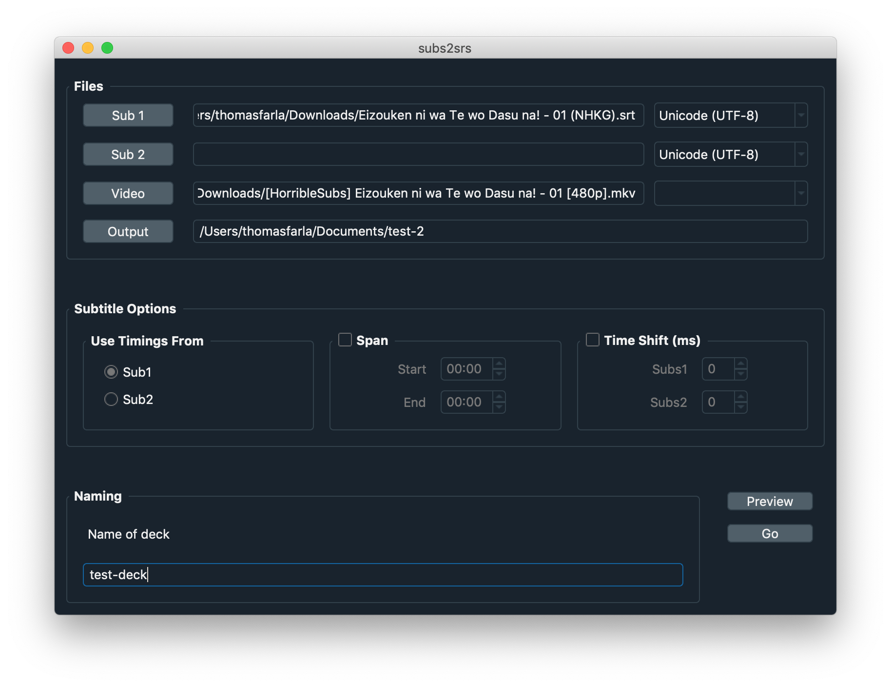
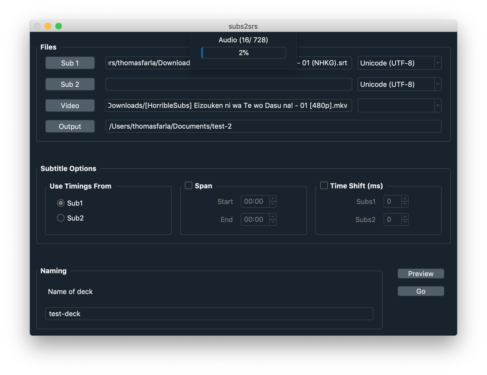

A cross platform app to generate flash cards from subtitles

# Status

Active development

# Motivation

Create an open source and cross platform alternative for the popular [subs2srs](http://subs2srs.sourceforge.net/).

# Screenshots

# Contribute

The project is still young and in active development so there's a lot to do. No effort has been made into issue tracking yet so for the time being. Please [create an issue](https://github.com/TFarla/subs2srs-cross-platform/issues/new) for any questions.
